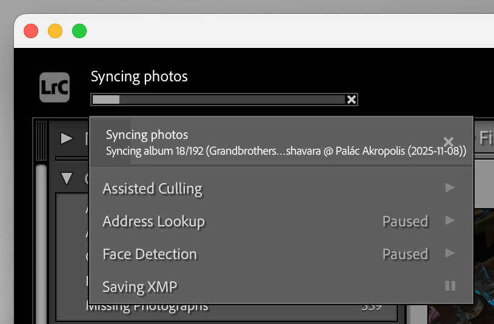
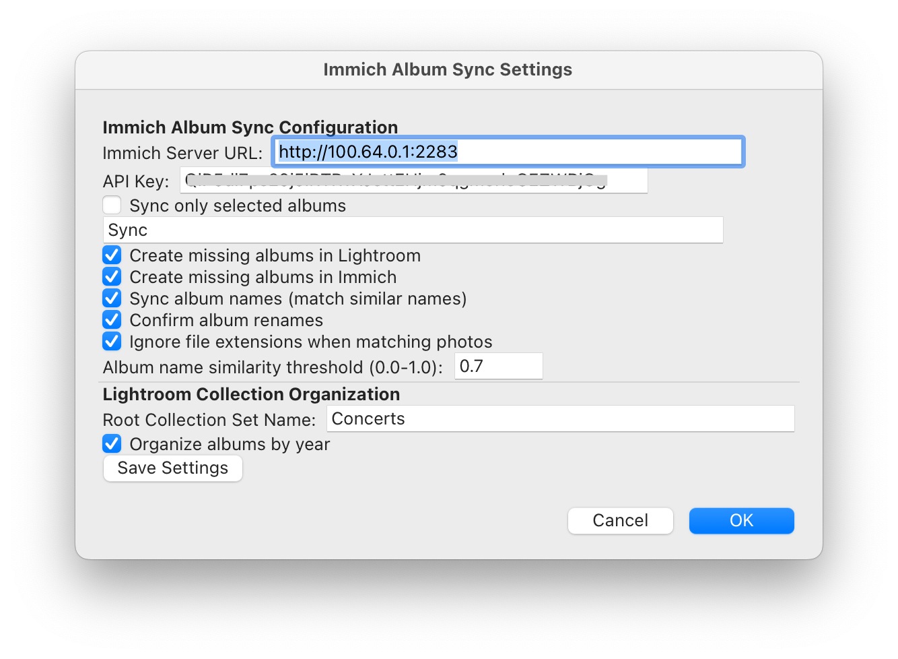
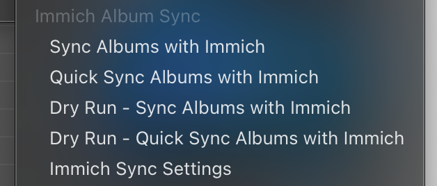
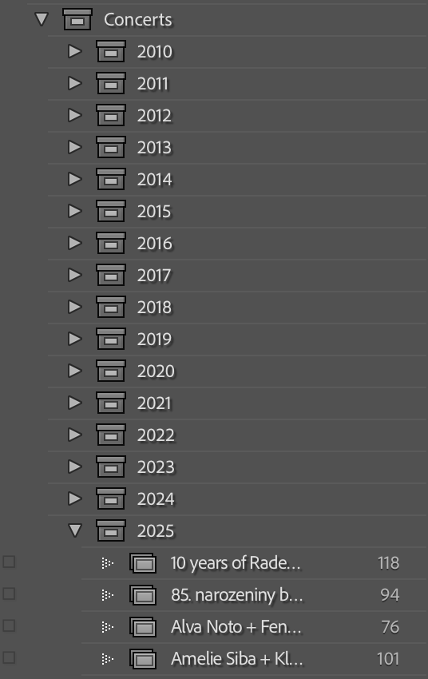

# Immich Album Sync plugin for Lightroom Classic

This plugin synchronizes albums between Lightroom Classic and Immich.

## Features

- Synchronize albums between Lightroom Classic and Immich
- Create missing albums in Lightroom Classic
- Create missing albums in Immich
- Sync album names (match similar names)
- Confirm album renames
- Ignore file extensions when matching photos
- Quick mode (only sync albums with different photo counts)
- Dry run mode (simulate sync without making changes)

## Installation

1. Download the plugin from Github
2. Extract the contents of the downloaded zip file to a folder on your computer
3. In Lightroom Classic, go to `File > Plugin Manager`
4. Click `Add` and select the extracted folder
5. Restart Lightroom Classic

## Usage

1. In Lightroom Classic, go to `File > Plugin Extras > Immich Sync Settings`
  - Enter your Immich server URL and API key
  - Configure the root collection set (optional) - in case not all albums in Lightroom should be synced with Immich, create a collection set to sync and provide its name here
  - Configure missing album handling
    - Whether to create missing albums in Lightroom Classic
    - Whether to create missing albums in Immich
  - Configure album name syncing
    - Whether to sync album names (match similar names)
    - Whether to ask for confirmation when renaming albums (recommended)
  - Configure photo matching
    - Whether to ignore file extensions when matching photos (i.e. consider RAW in Lightroom and JPEG in Immich the same photo)
  - Configure sync mode
    - Quick mode (only sync albums with different photo counts)
    - Dry run mode (simulate sync without making changes)

2. Go to `File > Plugin Extras` and select the desired sync option
  - *Sync Albums with Immich* - Full sync, it checks all photos in all albums (respecting the album filters configured in the settings)
  - *Quick Sync Albums with Immich* - Only sync albums with different photo counts (respecting the album filters configured in the settings)
  - *Dry Run - Sync Albums with Immich* - Simulate a full sync without making any changes
  - *Dry Run - Quick Sync Albums with Immich* - Simulate a quick sync without making any changes

## Notes

- Some versions of Lightroom were creating separate DNG files when applying Denoise or Super resolution to original RAW files. These files are considered the same photo as the original when syncing albums. All these "duplicates" will be included in the album in Lightroom when there is a matching photo in Immich. These copies are also excluded when calculating the quick mode photo count matches.

## Screenshots

### In-progress album sync

### Settings

### Menu options

### Album (collection) tree in Lightroom

